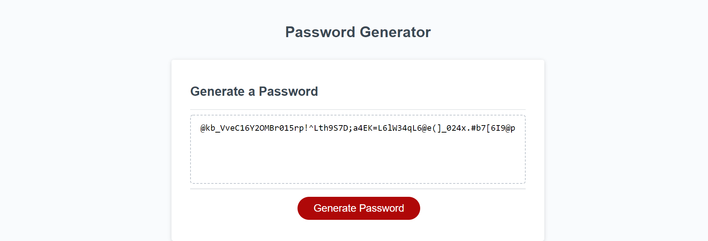

# Password Generator

## Description

In this homework project I have been tasked to create a function which returns a randomly generated password based on some user input. 

The website generates a password of a length between 8 and 128 characters (decided by the user), and uses at least one type of character from "special" characters (symbols like %, !, $ for example, a full list was used from: https://www.owasp.org/index.php/Password_special_characters), numbers (0-9), lower case and upper case characters (a,b,..z and A,B,...Z). I have also included some logic so that when the user picks a set of characters it is guaranteed to be included in the password.

I used and learnt about a range of interesting javascript including: 
  - The alert, prompt and confirm methods to gain user input
  - Conditional statements, and loops (for, do..while and while)
  - Arrays and Array methods
  - and the Math object, specifically Math.random

It also gave me an opportunity to think about logic and how to use javascript to achieve this.

Here is a screenshot of the finished website:

## Usage

The website can be viewed here: https://rileylum.github.io/password-generator/  

Click the 'Generate Password' button and follow the prompts and a random password will be generated.

## Credits

I found a number of resoures useful in this project:  

For user input:  
https://developer.mozilla.org/en-US/docs/Web/API/Window/alert
https://developer.mozilla.org/en-US/docs/Web/API/Window/prompt
https://developer.mozilla.org/en-US/docs/Web/API/Window/confirm

For conditional logic:  
https://developer.mozilla.org/en-US/docs/Web/JavaScript/Reference/Statements/while
https://developer.mozilla.org/en-US/docs/Web/JavaScript/Reference/Statements/do...

For random numbers:  
https://developer.mozilla.org/en-US/docs/Web/JavaScript/Reference/Global_Objects/Math/random

For array methods:  
https://developer.mozilla.org/en-US/docs/Web/JavaScript/Reference/Global_Objects/Array/splice
